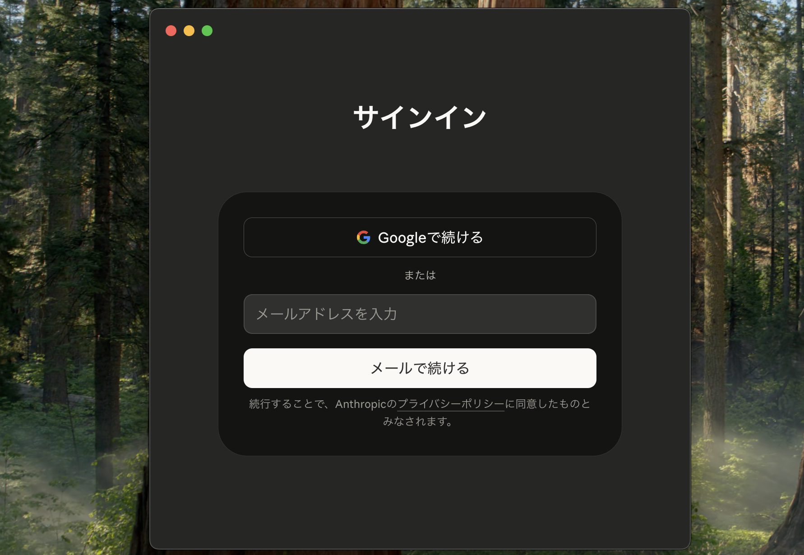

# ステップ② Claude Desktop のインストール

Anthropic 公式のデスクトップアプリをインストールし、  
アプリ内の **Code タブ** から Claude Code を使えるようにします。

## Claude Desktop とは？

Claude Desktop は、ブラウザを開かなくても Claude と会話できる公式アプリです。  
アプリ上部の **「Code」タブ** を選ぶと、ターミナル（黒い画面）を使わずに Claude Code の機能を利用できます。

## インストール手順 — macOS

### ① ダウンロードする

ブラウザで **[https://claude.com/download](https://claude.com/download)** を開き、**「Download for macOS」** ボタンをクリックしてください。  
ダウンロードフォルダにファイルが保存されます。

### ② アプリをインストールする

1. ダウンロードフォルダにある **`.dmg`** ファイルをダブルクリックして開く
2. ウィンドウが開き、左に **「Claude」** アイコン、右に **「Applications」** フォルダが表示される
3. **「Claude」アイコンを「Applications」フォルダの上にドラッグ＆ドロップ**する
4. コピーが完了したらウィンドウを閉じる

### ③ アプリを起動する

1. **Finder** を開き、左サイドバーの **「アプリケーション」** をクリック
2. 一覧の中から **「Claude」** をダブルクリックして起動
3. 「"Claude" はインターネットからダウンロードされたアプリケーションです。開いてもよろしいですか？」と表示されたら **「開く」** をクリック

## インストール手順 — Windows

### ① ダウンロードする

ブラウザで **[https://claude.com/download](https://claude.com/download)** を開き、**「Download for Windows」** ボタンをクリックしてください。  
ダウンロードフォルダにファイルが保存されます。

### ② アプリをインストールする

1. ダウンロードフォルダにある **`.exe`** ファイルをダブルクリック
2. 「このアプリがデバイスに変更を加えることを許可しますか？」→ **「はい」** をクリック
3. インストールが自動で進む（数十秒）
4. 完了すると Claude Desktop が自動で起動する

## Claude Desktop にログインする

アプリが起動すると、ログイン画面が表示されます。

1. **「Googleで続ける」** をクリック — ステップ①で使用した Google アカウントでログイン
2. または **「メールで続ける」** をクリック — メールアドレスとパスワードを入力
3. ホーム画面が表示されたらログイン完了

## Claude Code（Code タブ）を開く

1. アプリ上部中央に **「Chat」「Cowork」「Code」** の 3 つのタブが表示されている
2. **「Code」** タブをクリック

::: tip 「Code」タブをクリックするとアップグレードを促す画面が表示された場合
Pro プランへの加入がまだ完了していない可能性があります。  
[ステップ①](/online-course/setup/01-pro-subscription) に戻って Pro プランへの加入を完了してください。
:::

3. 「Select folder」ボタンが表示されたら、作業したいフォルダを選択するとセッションを開始できます

## 次のステップ

Claude Desktop のインストールが完了したら [ステップ③ Git のインストール](/online-course/setup/03-git-install) に進んでください。
