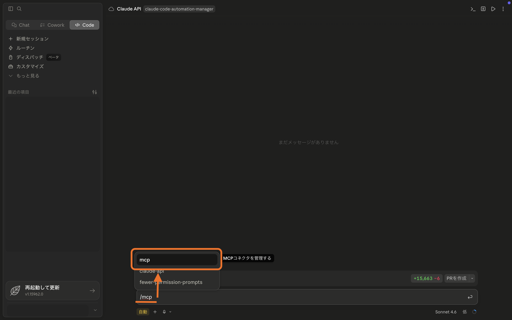
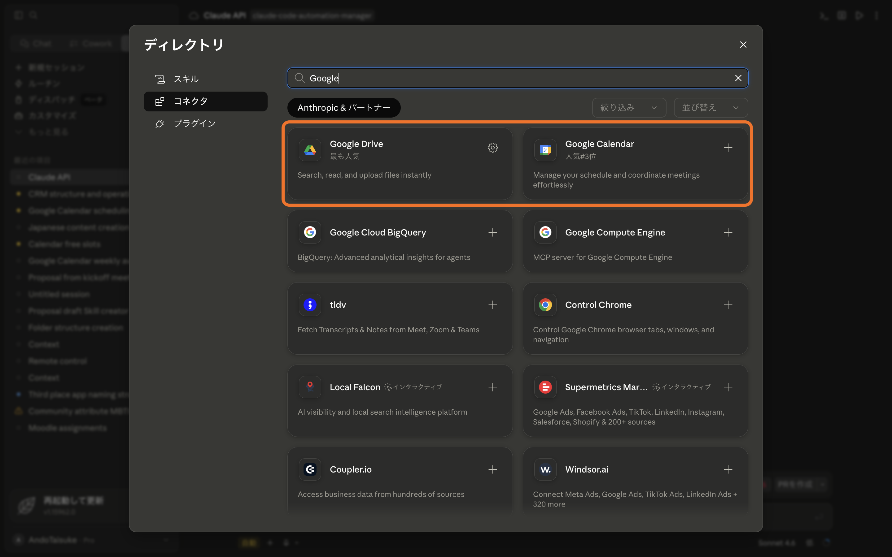

# ステップ④ MCP サーバーの接続設定

Claude Code に外部サービスを連携させる **MCP（エムシーピー）** の設定を行います。  
Gmail・Microsoft 365・Google カレンダー・Google ドライブを Claude から操作できるようになります。

## MCP とは？

MCP（Model Context Protocol）は、**Claude Code に外部サービスを接続する仕組み**です。

MCP を設定することで、Claude が直接 Gmail の内容を読んだり、  
Google カレンダーの予定を確認したり、Google ドライブのファイルを操作したりできるようになります。

## 今回接続するサービス

| サービス | できること |
|---|---|
| **Gmail** | メールの確認・検索・下書き作成 |
| **Microsoft 365** | Outlook メール・OneDrive・予定表の操作 |
| **Google カレンダー** | 予定の確認・追加・変更 |
| **Google ドライブ** | ファイルの検索・閲覧・作成 |

## 接続手順

### ① Code タブのチャット入力欄を開く

Claude Desktop を起動し、アプリ上部の **「Code」** タブをクリックしてください。  
プロジェクトフォルダを選択してセッションを開始すると、画面下部にチャット入力欄が表示されます。

### ② /mcp コマンドを実行する



チャット入力欄に以下を入力して `Enter` を押してください:

```
/mcp
```

接続可能なサービスの一覧が表示されます。



### ③ Gmail を接続する

1. 一覧から **「Gmail」** の行にある **「+」** ボタンをクリック
2. ブラウザが自動で開き、**[https://accounts.google.com](https://accounts.google.com)** の Google ログイン画面が表示される
3. Gmail に使用している Google アカウントのメールアドレスを入力し **「次へ」** をクリック
4. パスワードを入力し **「次へ」** をクリック
5. 「Claude Code が Google アカウントへのアクセスを求めています」という画面が表示されたら **「許可」** をクリック
6. 「接続が完了しました」と表示されたらブラウザを閉じ、Claude Desktop に戻る

### ④ Microsoft 365 を接続する

1. 一覧から **「Microsoft 365」** の行にある **「+」** ボタンをクリック
2. ブラウザが自動で開き、**[https://login.microsoftonline.com](https://login.microsoftonline.com)** の Microsoft ログイン画面が表示される
3. Microsoft アカウントのメールアドレスを入力し **「次へ」** をクリック
4. パスワードを入力し **「サインイン」** をクリック
5. 「アクセス許可の要求」画面が表示されたら **「承諾」** をクリック
6. 「接続が完了しました」と表示されたらブラウザを閉じ、Claude Desktop に戻る

::: info Microsoft 365 アカウントについて
会社や学校から付与された職場アカウント（例: `名前@会社名.com`）、  
または個人の Microsoft アカウント（例: `名前@outlook.com`）でログインしてください。
:::

### ⑤ Google カレンダーを接続する

1. 一覧から **「Google Calendar」** の行にある **「+」** ボタンをクリック
2. ブラウザが自動で開き、Google ログイン画面（[https://accounts.google.com](https://accounts.google.com)）が表示される
3. Google アカウントでログイン（③ と同じ手順）
4. 「Claude Code が Google カレンダーへのアクセスを求めています」という画面で **「許可」** をクリック
5. 「接続が完了しました」と表示されたらブラウザを閉じ、Claude Desktop に戻る

### ⑥ Google ドライブを接続する

1. 一覧から **「Google Drive」** の行にある **「+」** ボタンをクリック
2. ブラウザが自動で開き、Google ログイン画面（[https://accounts.google.com](https://accounts.google.com)）が表示される
3. Google アカウントでログイン（③ と同じ手順）
4. 「Claude Code が Google ドライブへのアクセスを求めています」という画面で **「許可」** をクリック
5. 「接続が完了しました」と表示されたらブラウザを閉じ、Claude Desktop に戻る

## トラブルシューティング

**ブラウザが自動で開かない場合**  
Claude Code の画面に認証用の URL が表示されます。その URL をコピーして、ブラウザのアドレスバーに貼り付けてアクセスしてください。

**「このアプリはブロックされています」と表示される場合**  
会社や学校のアカウントでは、管理者によってサードパーティアプリの連携が制限されている場合があります。個人の Google アカウントで試すか、IT 担当者にご確認ください。

**接続後に「Disconnected」と表示される場合**  
Claude Desktop を一度終了して再起動し、`/mcp` で再確認してください。

## セットアップ完了

4 つのサービスの接続が確認できたら、セットアップはすべて完了です。  
Claude Code Desktop から Gmail・Google カレンダー・Google ドライブ・Microsoft 365 を使った操作ができるようになりました。
